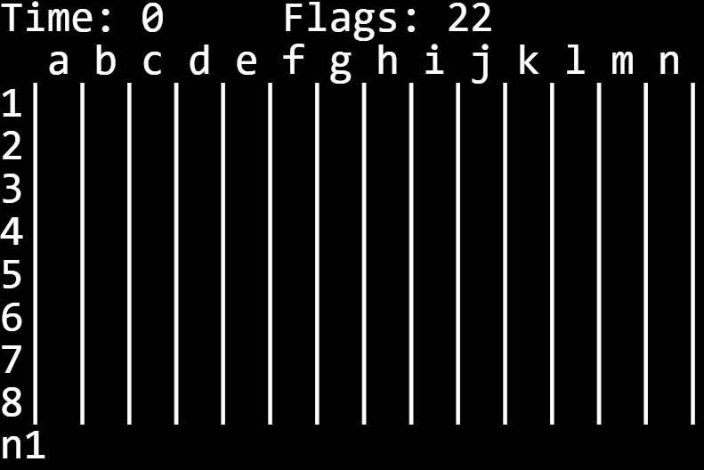

# Minesweeper
This is a simple console game of minesweeper created with Python.

## How to Play

### Setup
To start playing, simply download the repository and run Minesweeper.py. This will require Python 3 to be installed.

### First Move
To start, type in the coordinates of the tile just like in a game of Battleship e.g. `g7` then press <kbd>enter</kbd>.

### Subsequent Moves
The first move is assumed to be a `dig` operation. All subsequent moves require a flag character before the coordinates to specify whether you want to dig (`d`), flag (`f`), or remove a flag (`r`).

*Example sequence of moves:*  
| Move # | Desired Action          | Command                      |
| :-:    | -:                      | -                            |
| 1      | dig tile `h5`           | `h5` (no flag on first move) |
| 2      | dig tile `h6`           | `dh6`                        |
| 3      | flag tile `c9`          | `fc9`                        |
| 4      | clear flag on tile `c9` | `rc9`                        |

## Additional Info
Two small pieces of information are updated and displayed after each move. The first is the time measured in seconds since the start of the game, and the second is the number of flags left which can be used to keep track of how many mines are left.

> **Note:** There is no limit on the number of flags that can be placed. The counter is just an aid.
